# Samba AD DC Lab on Ubuntu 24.04

[](https://github.com/yossefseit/samba-ad-dc-lab/actions/workflows/ci.yml)

A guarded, script-assisted lab for building the first Samba Active Directory Domain Controller in a new forest. It demonstrates the hybrid identity foundations behind DNS-based service discovery, Kerberos authentication, directory objects, Group Policy support, signed domain time, verification, and recoverable operations.

> This repository contains authored automation and a validation plan. It does **not** contain evidence of a live deployment, client domain join, runtime authentication, restore drill, or teardown test. Treat every numbered script as privileged infrastructure code and run it only on a dedicated, disposable Ubuntu 24.04 lab host.

## What the lab builds



The diagram's editable source is [`diagrams/samba-ad-dc-architecture.mmd`](diagrams/samba-ad-dc-architecture.mmd).
The backup script creates only the local archive and checksum; copying and encrypting them for offline retention is an explicit operator step.

The DC is dedicated to identity services. It is not configured as a general-purpose file server, internet-facing host, DHCP server, or production service.

## Implementation status

| Capability | Authored | Repository CI | Live deployed | Runtime tested | Recovery tested |
| --- | ---: | ---: | ---: | ---: | ---: |
| Host and package preflight | Yes | See Actions | No evidence | No evidence | N/A |
| First-forest provisioning | Yes | Static checks only | No evidence | No evidence | No |
| Internal DNS and Kerberos configuration | Yes | Static checks only | No evidence | No evidence | No |
| Signed domain time with Chrony | Yes | Static checks only | No evidence | No evidence | No |
| Sample OU and user automation | Yes | Static checks only | No evidence | No evidence | No |
| Online backup and isolated restore plan | Yes | Static checks only | No evidence | No evidence | No |

CI can lint and test repository code; it cannot prove that Samba was provisioned, that authentication worked, or that a backup restored successfully.

## Safety properties

- Configuration is parsed as data rather than sourced as root-executable shell code.
- Passwords are never accepted in `scripts/00-env`; Samba prompts interactively.
- Provisioning skips an existing matching domain and refuses mismatched state instead of reprovisioning it.
- Original host configuration is copied once to `/var/lib/samba-ad-dc-lab/original` before mutation.
- DNS activation restores the pre-run Samba configuration, resolver, and service state if activation fails.
- Verification returns a non-zero exit code when a required check fails.
- DNS forwarding rejects loopback, link-local, multicast, unspecified, and self-referential targets.
- Signed NTP access is scoped to the configured lab CIDR. Firewall rules remain an explicit operator responsibility.
- Teardown is deliberately documented rather than automated because destroying a sole domain controller is irreversible and environment-dependent.

See [Security and access model](docs/security.md) for ports, trust boundaries, and production gaps.

## Quick start

### 1. Prepare a disposable host

Create a fresh Ubuntu 24.04 VM with a persistent static IPv4 address, a reserved DHCP lease or address outside the DHCP pool, working upstream DNS, synchronized time, and a recoverable hypervisor snapshot. Do not use a workstation or a host with an existing Samba domain.

```bash
sudo apt-get update
sudo apt-get install -y git
git clone https://github.com/yossefseit/samba-ad-dc-lab.git
cd samba-ad-dc-lab
cp scripts/00-env.example scripts/00-env
nano scripts/00-env
```

The example uses `ad.example.test`, a reserved test namespace that avoids the multicast-DNS conflict caused by `.local`. For a durable environment, choose a subdomain of a DNS name you control before provisioning; Samba does not support casually renaming the AD DNS zone and Kerberos realm.

### 2. Review and run each stage

Read the matching document before each privileged script. Do not run the sequence unattended.

```bash
sudo bash scripts/10-prereqs.sh
sudo bash scripts/20-install.sh
sudo bash scripts/30-provision.sh
sudo bash scripts/40-dns-forwarder.sh
sudo bash scripts/45-time-sync.sh
sudo bash scripts/50-verify.sh
sudo bash scripts/60-create-objects.sh  # optional
sudo bash scripts/70-backup.sh          # optional but recommended
```

`30-provision.sh`, `60-create-objects.sh`, and `70-backup.sh` prompt for credentials where required. They never read a password from the repository configuration.

### 3. Complete manual evidence checks

The automated verifier intentionally does not handle credentials. Complete the Kerberos, SYSVOL/NETLOGON, Windows client join, Group Policy, backup restore, and teardown checks in [Verification and evidence](docs/04-verify.md).

## Repository map

| Path | Purpose |
| --- | --- |
| [`diagrams/`](diagrams/) | Editable Mermaid architecture source and accessible optimized SVG export |
| [`scripts/`](scripts/) | Guarded installation, configuration, validation, object, and backup automation |
| [`scripts/lib/common.sh`](scripts/lib/common.sh) | Allow-listed configuration parser and shared safety checks |
| [`docs/01-install.md`](docs/01-install.md) | Host, network, package, and firewall prerequisites |
| [`docs/02-provision.md`](docs/02-provision.md) | New-forest provisioning and rerun boundaries |
| [`docs/03-dns-kerberos.md`](docs/03-dns-kerberos.md) | DNS, Kerberos, and signed time configuration |
| [`docs/04-verify.md`](docs/04-verify.md) | Automated and manual positive/negative tests |
| [`docs/05-backup-recovery.md`](docs/05-backup-recovery.md) | Domain backup and isolated restore drill |
| [`docs/06-teardown.md`](docs/06-teardown.md) | Safe lab teardown and host rollback boundaries |
| [`docs/security.md`](docs/security.md) | Threat model, ports, controls, and production gaps |
| [`tests/`](tests/) | Offline parser, syntax, documentation-link, and secret-pattern checks |

## Local repository validation

These checks do not touch Samba or require root:

```bash
bash tests/static.sh
```

When ShellCheck is installed, the same entry point runs it automatically. CI installs ShellCheck before invoking the tests.

## Design decisions and limitations

- **Samba internal DNS** keeps the first-DC lab focused. BIND9 DLZ, DNSSEC design, DHCP secure updates, and multi-DC replication are outside scope.
- **Reverse DNS is a documented follow-up.** The scripts verify forward and service-discovery records but do not guess a reverse zone for an operator-owned subnet.
- **Interactive secrets** trade unattended provisioning for safer password handling. Passing `--adminpass` would expose a secret in process arguments and often shell history.
- **A single DC is a failure domain.** A production design needs at least two domain controllers, tested replication, monitored backups, patch/change processes, and a documented FSMO recovery strategy.
- **No automatic firewall changes** avoids locking operators out of unknown network environments. Apply the allow-list in [Security and access model](docs/security.md) before joining a client.
- **No deployment claim** is derived from Bash syntax, ShellCheck, documentation, or GitHub Actions results.

## Official references

- [Ubuntu Server: Provisioning a Samba Active Directory Domain Controller](https://ubuntu.com/server/docs/how-to/samba/provision-samba-ad-controller/)
- [Samba Wiki: Setting up Samba as an Active Directory Domain Controller](https://wiki.samba.org/index.php/Setting_up_Samba_as_an_Active_Directory_Domain_Controller)
- [Samba Wiki: Time Synchronisation](https://wiki.samba.org/index.php/Time_Synchronisation)
- [Samba Wiki: Back up and Restoring a Samba AD DC](https://wiki.samba.org/index.php/Back_up_and_Restoring_a_Samba_AD_DC)
- [`samba-tool` manual](https://www.samba.org/samba/docs/current/man-html/samba-tool.8.html)

## License

Released under the [MIT License](LICENSE). Samba and Ubuntu retain their own licenses and trademarks.
